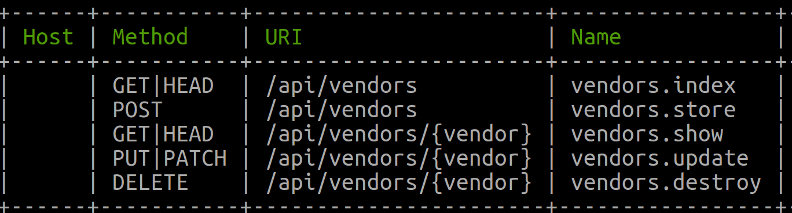

## Who is this article for?

Anyone looking for how to validate unique database column with Laravel Soft-Delete options.

In this article, I’m going to walk through, how to create migration with indexes, create two separate requests for creating and updating a resource with one column as unique and using soft-delete.

## Before You Begin

In this article, we are going to create a new vendor table via migration. The table will have `id`, `name`, `created_at`, `updated_at` and `deleted_at` columns. The `name` column will be unique. Which means that vendor name should be unique. But this unique validation should exclude the records that are soft-deleted by Laravel.

The API routes will look something like this -



## Step 1 – Create the migration.

```php
<?php

use Illuminate\Support\Facades\Schema;
use Illuminate\Database\Schema\Blueprint;
use Illuminate\Database\Migrations\Migration;

class CreateVendorsTable extends Migration
{
    /**
     * Run the migrations.
     *
     * @return void
     */
    public function up()
    {
        Schema::create('vendors', function (Blueprint $table) {
            $table->increments('id');
            $table->string('name');
            $table->timestamps();
            $table->softDeletes();
            $table->unique(['name', 'deleted_at']);
        });
    }

    /**
     * Reverse the migrations.
     *
     * @return void
     */
    public function down()
    {
        Schema::dropIfExists('vendors');
    }
}
```

As you can see in the migration, rather than having the `name` as a unique column, we are using `name` and `deleted_at` as composite unique keys.

## Step 2 - Create a Store Vendor Request Class

We will be using the Laravel Requests to validate the input sent by frontend before creating a new resource.

```php
<?php

namespace App\Api\Requests\Vendor;

use Dingo\Api\Http\FormRequest;

class StoreVendorRequest extends FormRequest
{
    /**
     * Validate rules
     *
     * @return array
     */
    public function rules()
    {
        // Only allow unique pair of name, and deleted at
        return [
            "name" => "required|unique:vendors,name,NULL,id,deleted_at,NULL",
        ];
    }

    /**
     * Handled by middleware
     *
     * @return true
     */
    public function authorize()
    {
        return true;
    }
}
```

p>This request will look into the database where `deleted_at` is null and then compare the names with the name that was sent via the request.

Behind the scene, Laravel runs this SQL query -

```sql
SELECT
  COUNT(*) AS aggregate
FROM vendors
WHERE
  name = "CVS" -- This is a test name sent by the request
  and deleted_at IS NULL; 
```
 
## Step 3 - Create an Update Vendor Request Class

So, our save request validation look good, what about the update request. A user can update the name of the vendor too. So now we need to create a validation for the update.

As you can see above in the API route for an update, we are passing the `id` of the vendor and laravel resolve it to object. We can leverage the object in the request validation and use it like -

```php
<?php

namespace App\Api\Requests\Vendor;

use Dingo\Api\Http\FormRequest;

class UpdateVendorRequest extends FormRequest
{
    /**
     * Validate rules
     *
     * @return array
     */
    public function rules()
    {
        // Get the id of vendor from path route
        $id = $this->route('vendor')->id;
        // Unique name with deleted at
        return [
            'name' => "required|unique:vendors,name,{$id},id,deleted_at,NULL",
        ];
    }

    /**
     * Handled by middleware
     *
     * @return true
     */
    public function authorize()
    {
        return true;
    }
}
```

Laravel fires the following SQL Query to validate the update request name param.

```sql
SELECT
  COUNT(*) AS aggregate
FROM vendors
WHERE
  name = "CVS"
  AND id <> 1
  AND deleted_at IS NULL;
```

And so this is how you can use unique column along with soft-deletes in Laravel.

I know, this article was supposed to be how to test a multi-database Laravel project using SQLite in-memory DB for all databases, I will be covering that in a future article.

