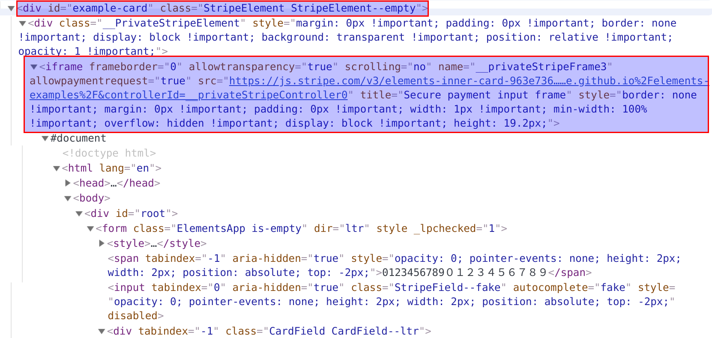

## Who is this article for?

Anyone looking for how to test stripe effectively with Laravel Dusk.

In this article, I’m going to walk through, how to effectively test Stripe with Laravel Dusk. We will use using Stripe Elements as our test case.

## Before You Begin

Lets quickly review how Stripe Elements work and what are the challenges we need to address.

To use Stripe Elements, we first add CSS in the <head> and a JavaScript before `</body>`. Within the `<body>` we then add a `<div>` something like this


```html
<div id="example-card" class="input"></div>
```

The id of the div is reference within the JavaScript which load an iframe inside the above div. The rendered page code looks something like this -



Alright, so we need to have dusk input values inside an iframe. We know that dusk is built on top of facebook php-webdrive and it can switch between frames and type in iframes.

```php
$myFrame = $driver->findElement(WebDriverBy::id('my_frame'));
$driver->switchTo()->frame($myFrame); 
```

Lets, give this a try. The first version of the test looks something like this.

```php
<?php

namespace Tests\Browser\Components;

use Tests\DuskTestCase;

class StripeElementsTest extends DuskTestCase
{
    /**
     * Test for adding cc to stripe elements using dusk
     * @test
     * @throws \Throwable
     */
    public function stripe_element_add_card_test()
    {
        $this->browse(function ($browser) use ($this->user) {
            $browser->loginAs($this->user)
                ->visit(route('user.addCard'))
                ->type('cardholder-name', 'Jonny Doe')
                ->type('address-zip', '33613')
                // step below will ensure that the stripe lib is fully loaded
                ->waitFor('#example-card iframe');
            
            // Lets make the switch to iframe
            $browser->driver->switchTo()->frame('__privateStripeFrame3');
            
            // Enter values for cc number, expiration date and cvc
            // Making sure that the input box is loaded
            $browser->waitfor('input[name="cardnumber"]')
                ->type('cardnumber', '4242 4242 4242 4242')
                ->type('exp-date', '12 50')
                ->type('cvc', '123');
            
            // Switch back to the main frame
            $browser->driver->switchTo()->defaultContent();
            
            // Submit the form, from the main frame
            // This will be the submit button id in your case.
            $browser->click('#m--btn-card-submit');
            
            // Perform your others checks.............
        });
    }
}
```

Ok, this seems to be working. But there are a few things I don't like with this approach. Below we will address each point and refactor our test case.

## Refactor 1

As you can see above, we are directly referencing the iframe name "**_\_\_privateStripeFrame3_**". If Stripe changes the name of the iframe, our Dusk tests will stop working. So we need to use a relative path to get the iframe. Luckily, the `$browser` object has a way to execute Javascript from within the tests.

This can be used like

```php
$browser->script($scripts); // $scripts can be an array.
```

So, now rather than referencing iframe name "_**\_\_privateStripeFrame3**_" we will use our main div id `#example-card` and try to locate the iframe within. After first refactoring, our code looks something this.

```php
<?php

namespace Tests\Browser\Components;

use Tests\DuskTestCase;

class StripeElementsTest extends DuskTestCase
{
    /**
     * Test for adding cc to stripe elements using dusk
     * @test
     * @throws \Throwable
     */
    public function stripe_element_add_card_test()
    {
        $this->browse(function ($browser) use ($this->user) {
            $browser->loginAs($this->user)
                ->visit(route('user.addCard'))
                ->type('cardholder-name', 'Jonny Doe')
                ->type('address-zip', '33613')
                // step below will ensure that the stripe lib is fully loaded
                ->waitFor('#example-card iframe');

            // Lets make the switch to iframe, we are using our main example card div
            // and getting the child iframe name using javascript
            $browser->driver
                ->switchTo()
                ->frame($browser->script('return $("#example-card iframe").attr("name");')[0]);

            // Enter values for cc number, expiration date and cvc
            // Making sure that the input box is loaded
            $browser->waitfor('input[name="cardnumber"]')
                ->type('cardnumber', '4242 4242 4242 4242')
                ->type('exp-date', '12 50')
                ->type('cvc', '123');

            // Switch back to the main frame
            $browser->driver->switchTo()->defaultContent();

            // Submit the form, from the main frame
            // This will be the submit button id in your case.
            $browser->click('#m--btn-card-submit');

            // Perform your others checks.............
        });
    }
}
```

## Refactor 2

Dusk tends to input values in the text box at lighting fast speed. Stripe Elements drop in is pretty Javascript heavy, this causes dusk to input the cc numbers incorrectly as Stripe JS tries to parse and validate cc numbers of every keystroke.

To avoid this, we are going to add pauses after every digit. We will be using the `append()` method for the same.

```php
<?php

namespace Tests\Browser\Components;

use Tests\DuskTestCase;

class StripeElementsTest extends DuskTestCase
{
    /**
     * Test for adding cc to stripe elements using dusk
     * @test
     * @throws \Throwable
     */
    public function stripe_element_add_card_test()
    {
        $this->browse(function ($browser) use ($this->user) {
            $browser->loginAs($this->user)
                ->visit(route('user.addCard'))
                ->type('cardholder-name', 'Jonny Doe')
                ->type('address-zip', '33613')
                // step below will ensure that the stripe lib is fully loaded
                ->waitFor('#example-card iframe');

            // Lets make the switch to iframe, we are using our main example card div
            // and getting the child iframe name using javascript
            $browser->driver
                ->switchTo()
                ->frame($browser->script('return $("#example-card iframe").attr("name");')[0]);

            // Enter values for cc number, expiration date and cvc
            // Making sure that the input box is loaded
            $browser->waitfor('input[name="cardnumber"]');

            // Avoiding dusk super speed to input incorrect cc number.
            foreach (str_split('4242424242424242') as $char) {
                $browser->append('cardnumber', $char)->pause(100);
            }
            
            $browser->type('exp-date', '12 50')
                ->type('cvc', '123');

            // Switch back to the main frame
            $browser->driver->switchTo()->defaultContent();

            // Submit the form, from the main frame
            // This will be the submit button id in your case.
            $browser->click('#m--btn-card-submit');

            // Perform your others checks.............
        });
    }
}
```

## Refactor 3

This is starting to look good and is working very smoothly. The only thing I would now like to refactor is to abstract out the switch to iframe and back. It currently looks like a lot of things are happening in this line.

```php
$browser->driver
    ->switchTo()
    ->frame($browser->script('return $("#example-card iframe").attr("name");')[0]);
```

We will be using Dusk browser macros, using macros makes the code a little more readable.

Let's create a macro inside `DuskServiceProvider.php`.

```php
<?php

namespace App\Providers;

use Illuminate\Support\ServiceProvider;
use Laravel\Dusk\Browser;

class DuskServiceProvider extends ServiceProvider
{
    /**
     * Bootstrap services.
     *
     * @return void
     */
    public function boot()
    {
        Browser::macro('switchToFrame', function ($frameNameOrDivId = null, $childOfDiv = false) {
            switch (true) {
                // If the frame is child of div, we will use script to get the frame name
                case $childOfDiv && $frameNameOrDivId:
                    $this->driver
                        ->switchTo()
                        ->frame($this->script("return $(\"#{$frameNameOrDivId} iframe\").attr(\"name\");")[0]);
                    break;
                // Not a child of Div and frame name is set
                case !$childOfDiv && $frameNameOrDivId:
                    $this->driver->switchTo()->frame($frameNameOrDivId);
                    break;
                // By Default switch back to main frame
                default:
                    $this->driver->switchTo()->defaultContent();
            }

            return $this;
        });
    }
    /**
     * Register services.
     *
     * @return void
     */
    public function register()
    {
    }
}
```

```php
<?php

namespace Tests\Browser\Components;

use Tests\DuskTestCase;

class StripeElementsTest extends DuskTestCase
{
    /**
     * Test for adding cc to stripe elements using dusk
     * @test
     * @throws \Throwable
     */
    public function stripe_element_add_card_test()
    {
        $this->browse(function ($browser) use ($this->user) {
            $browser->loginAs($this->user)
                ->visit(route('user.addCard'))
                ->type('cardholder-name', 'Jonny Doe')
                ->type('address-zip', '33613')
                // step below will ensure that the stripe lib is fully loaded
                ->waitFor('#example-card iframe');

            // Lets make the switch to iframe using the macro
            $browser->switchToFrame($frameNameOrDivId = 'example-card', $childOfDiv = true);

            // Enter values for cc number, expiration date and cvc
            // Making sure that the input box is loaded
            $browser->waitfor('input[name="cardnumber"]');

            // Avoiding dusk super speed to input incorrect cc number.
            foreach (str_split('4242424242424242') as $char) {
                $browser->append('cardnumber', $char)->pause(100);
            }

            $browser->type('exp-date', '12 50')
                ->type('cvc', '123');

            // Switch back to the main frame
            $browser->switchToFrame();

            // Submit the form, from the main frame
            // This will be the submit button id in your case.
            $browser->click('#m--btn-card-submit');

            // Perform your others checks.............
        });
    }
}
```

The last refactor is entirely optional.

## Clean Up

In the medium article, the author is deleting the subscription from the user and then removing the customer from Stripe. I use SQLite disposable DB for Dusk tests and a totally unrelated stripe account. Since the dusk .env file is by default under source control, I don't use any keys which are in any shape or form related to my working environment. I do a regular cleanup of my test Stripe account depending on my test activities. [Click here](https://stackoverflow.com/questions/35542621/how-to-delete-the-logs-on-stripe-in-a-test-environment/44653616) to find how to delete all test data from Stripe.

In the next articles, I will talk about how to test a multi-database Laravel project using SQLite in-memory DB for all databases.

### References

*   [https://github.com/facebook/php-webdriver/wiki/Alert,-tabs,-frames,-iframes#frame-iframe](https://github.com/facebook/php-webdriver/wiki/Alert,-tabs,-frames,-iframes#frame-iframe)
*   [https://github.com/laravel/dusk/blob/master/src/Concerns/InteractsWithJavascript.php#L13](https://github.com/laravel/dusk/blob/master/src/Concerns/InteractsWithJavascript.php#L13)
*   [https://github.com/laravel/dusk/issues/558](https://github.com/laravel/dusk/issues/558)
*   [https://github.com/laravel/dusk/blob/master/src/Concerns/InteractsWithElements.php#L154](https://github.com/laravel/dusk/blob/master/src/Concerns/InteractsWithElements.php#L154)
*   [https://laravel.com/docs/5.7/dusk#browser-macros](https://laravel.com/docs/5.7/dusk#browser-macros)
*   [https://medium.com/@phpTechnocrat/how-to-use-laravel-dusk-to-test-stripe-cashier-c27471c0383](https://medium.com/@phpTechnocrat/how-to-use-laravel-dusk-to-test-stripe-cashier-c27471c0383)
*   [https://stackoverflow.com/questions/35542621/how-to-delete-the-logs-on-stripe-in-a-test-environment/44653616](https://stackoverflow.com/questions/35542621/how-to-delete-the-logs-on-stripe-in-a-test-environment/44653616)

