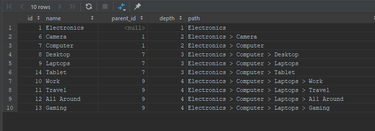

## Who is this article for?

Anyone looking for how Manage Hierarchical Data in MySQL with Adjacency List Model using CTE (Common Table Expressions).

In this article, I’m going to walk through on how to retrieve, insert and update hierarchical data.

## Before You Begin

If you don't know what CTE's are, I would highly recommend reading about it. Since v8.x, MySQL has added support for CTE which it was missing for quite some time.

Before v8.X, it was challenging to retrieve data from the Adjacency List Model as outlined in the [Mike Hillyer](http://mikehillyer.com/articles/managing-hierarchical-data-in-mysql/) article.

Just to give you a brief overview of how Recursive CTE works, let's check the pseudo code below.

```sql
CTE DEFINITION (
  ANCHOR (SQL STATEMENT 1)
  UNION ALL
  RECURSIVE MEMBER (SQL STATEMENT 2)
)
SELECT * FROM CTE
```

*   The first line is the CTE definition, for a recursive CTE it looks something like `WITH RECURSIVE cteName (columns) AS (`
*   Then the "**Anchor**" part is executed and generates a result, let's assume it generated result "**R1**",
*   After the anchor, "**Recursive Member**" gets executed using "**R1**" as input, let's says it generated result set "**R2**".
*   Again, "**Recursive Member**" gets executed using "**R2**" as input, this goes on until "**Recursive Member**" output is null.
*   Finally, "**Union All**" is applied to all output, and that becomes our final result set.

Hopefully, that is not too confusing, if so, google and read more about CTE's.

Let go over some of the common terms with adjacency list.

*   **Root Node** - This is the primary node, it is usually the node that does not have a parent but is a parent for one or more entities.
*   **Leaf nodes** - These are the node that does not have any children.
*   **Non-Leaf Node** - These are the node that has one or more children.
*   **Descendants** - All children, grandchildren, etc. of a node.
*   **Ancestors** - All parents, grandparent, etc. of a node.

You must be asking, how this article is different from the one posted [here](http://www.mysqltutorial.org/mysql-adjacency-list-tree/). Honestly, there is not much of a difference, but in this article, we'll cover some extra set of queries and use multiple recursive CTE for some queries. This makes it a little more advanced when compared to mysqltutorial.org article.

For this article, I will be using the below graph as an adjacency list.


Ok, now let's jump into creating a table and see how we can do inserts, updates, and selects.

## Step 1 - Create a table.

```sql
CREATE TABLE category (
  id int(10) UNSIGNED NOT NULL AUTO_INCREMENT,
  name varchar(255) NOT NULL,
  parent_id int(10) UNSIGNED DEFAULT NULL,
  is_active int(1) UNSIGNED DEFAULT 1,
  PRIMARY KEY (id),
  FOREIGN KEY (parent_id) REFERENCES category (id)
    ON DELETE CASCADE ON UPDATE CASCADE
);
```

As you can see I have added one additional column (`is_active`), we will be using this column later on in the select queries.

## Step 2 - Insert dummy records.

```sql
INSERT INTO category (name, parent_id) VALUES ("Electronics", null);
INSERT INTO category (name, parent_id) VALUES ("TV", 1);
INSERT INTO category (name, parent_id) VALUES ("Smart", 2);
INSERT INTO category (name, parent_id) VALUES ("4K Ultra HD", 2);
INSERT INTO category (name, parent_id) VALUES ("Curved", 2);
INSERT INTO category (name, parent_id) VALUES ("Camera", 1);
INSERT INTO category (name, parent_id) VALUES ("Computer", 1);
INSERT INTO category (name, parent_id) VALUES ("Desktop", 7);
INSERT INTO category (name, parent_id) VALUES ("Laptops", 7);
INSERT INTO category (name, parent_id) VALUES ("Work", 9);
INSERT INTO category (name, parent_id) VALUES ("Travel", 9);
INSERT INTO category (name, parent_id) VALUES ("All Around", 9);
INSERT INTO category (name, parent_id) VALUES ("Gaming", 9);
INSERT INTO category (name, parent_id) VALUES ("Tablet", 7);
```

## Step 3 - Selecting Data via CTE

### Finding the root node

```sql
SELECT 
  * 
FROM 
  category 
WHERE 
  parent_id IS NULL;
```


### Finding the immediate children of a node

You can first retrieve the id of the root node and then supply it here, or you can do a sub where clause.

```sql
SELECT 
  * 
FROM 
  category 
WHERE 
  parent_id = (SELECT id FROM category WHERE parent_id IS NULL);

```


### Finding the leaf nodes

```sql
SELECT
  c1.*
FROM
  category c1
    LEFT JOIN category c2 ON c2.parent_id = c1.id
WHERE
  c2.id IS NULL;
```


### Retrieving the whole tree

```sql
WITH RECURSIVE shoppingCategories AS
(
  SELECT id, name, parent_id, 1 AS depth, name AS path
    FROM category
    WHERE parent_id IS NULL
  UNION ALL
  SELECT c.id, c.name, c.parent_id, sc.depth + 1, CONCAT(sc.path, ' > ', c.name)
    FROM shoppingCategories AS sc 
      JOIN category AS c ON sc.id = c.parent_id
)
SELECT * FROM shoppingCategories;
```


### Retrieving the subtree.

We will now retrieve the `Laptop` subtree

```sql
WITH RECURSIVE shoppingCategories AS
(
  SELECT id, name, parent_id, 1 AS depth, name AS path
    FROM category
    WHERE id = 9
  UNION ALL
  SELECT c.id, c.name, c.parent_id, sc.depth + 1, CONCAT(sc.path, ' > ', c.name)
    FROM shoppingCategories AS sc 
      JOIN category AS c ON sc.id = c.parent_id
)
SELECT * FROM shoppingCategories;
```


### Retrieving only active categories

Let's make the `TV` category as inactive, remember we added the flag called `is_active`.

```sql
UPDATE category SET is_active = 0 WHERE id = 2;
```

Ok, Now we'll retrieve the complete tree again, but this time we will exclude any nodes that are inactive and exclude their descendants.

```sql
WITH RECURSIVE shoppingCategories AS
(
  SELECT id, name, parent_id, 1 AS depth, name AS path
    FROM category
    WHERE parent_id IS NULL
  UNION ALL
  SELECT c.id, c.name, c.parent_id, sc.depth + 1, CONCAT(sc.path, ' > ', c.name)
    FROM shoppingCategories AS sc 
      JOIN category AS c ON sc.id = c.parent_id
    WHERE c.is_active = 1
)
SELECT * FROM shoppingCategories;
```



### Retrieving the descendants and ancestors line

Now, let's say you are on the `Laptop` category and want to retrieve all the descendants and ancestors line. There are multiple ways to do that, I will go over the one that works best for me.


Retrieve all the descendants with positive depth and ancestors as negative depth.

```sql
WITH RECURSIVE
  ancestorCategories  AS
  (
    SELECT id, name, parent_id, 0 AS depth
      FROM category
      WHERE id = 9
    UNION ALL
    SELECT c.id, c.name, c.parent_id, ac.depth - 1
      FROM ancestorCategories AS ac 
        JOIN category AS c ON ac.parent_id = c.id
  ),
  descendantCategories  AS
  (
    SELECT id, name, parent_id, 0 AS depth
      FROM category
      WHERE id = 9
    UNION ALL
    SELECT c.id, c.name, c.parent_id, dc.depth + 1
      FROM descendantCategories AS dc 
        JOIN category AS c ON dc.id= c.parent_id
  )
SELECT * FROM ancestorCategories
UNION
SELECT * FROM descendantCategories
ORDER BY depth;
```


### Tree Expansion Query

Let's say you are building an expanding tree. When you click on `Electronics` it shows you all Level 1 children, i.e. `TV, Camera and Computer`, then if you select `Computer` it will show all Level 1 of Ancestor, i.e., `Electronics` plus Level 1 of `Computer`.

It will look something like this.


Here is how you do that

```sql
SET @catID = 9;
WITH RECURSIVE
  ancestorCategories  AS
  (
    SELECT id, name, parent_id, 1 AS depth
      FROM category
      WHERE id = @catID
    UNION ALL
    SELECT c.id, c.name, c.parent_id, ac.depth - 1
      FROM ancestorCategories AS ac
        JOIN category AS c ON ac.parent_id = c.id
  ),
  ancestorDeptOneCategories  AS
  (
    SELECT id, name, parent_id, 1 AS depth
      FROM category
      WHERE parent_id IS null
    UNION ALL
    SELECT c.id, c.name, c.parent_id, adoc.depth + 1
      FROM ancestorDeptOneCategories AS adoc
        JOIN ancestorCategories ac ON ac.id = adoc.id
        JOIN category AS c ON adoc.id = c.parent_id
  )
SELECT * FROM ancestorDeptOneCategories
ORDER BY depth;
```


Here you can see we are passing the id as variable `@catID`, in the first CTE we are getting all the ancestors including self, and then in the second CTE ancestorDeptOneCategories we are getting all first level descendants of those ancestors.

## Step 4 - Updating a parent.

This when you want to move a sub-tree. If we're going to move `Laptop`and all its descendants to a `Camera` we need to update the `parent_id` of `Laptop` record

```sql
UPDATE category SET parent_id = 6 where id = 9;
```
  
If we only want to move `Laptop` to `Camera` and promote its descendants we first update the parent of Level 1 children of `Laptop`, then update parent of `Laptop`.

```sql
UPDATE category SET parent_id = 7 where parent_id = 9;
UPDATE category SET parent_id = 6 where id = 9;
```
   
## Step 5 - Deleting a parent.

To delete a node and its descendants, just remove the node itself, all the descendants will be deleted automatically by the `DELETE CASCADE` of the foreign key constraint.

So if we want to remove `Laptop` then -

```sql
DELETE FROM category WHERE id = 9;
```
   
Delete a node and promote it, descendants, we first promote the descendants and then remove the node.

```sql
UPDATE category SET parent_id=7 where parent_id=9;
    DELETE FROM category WHERE id = 9;
```
    

## Conclusion

In my experience when you have a hierarchical relation that has nodes inserted or moved regularly, nested sets causes a lot of Database transaction locks and tends to be slow. We had faced issues when our hierarchy relationship was broken. If you implement nested set using mike hillyer methods, you will not be able to add unique constraints which mean the data can be corrupted quite easily.

### From the StackOverflow

> The Nested Set Model is nowadays not commonly used in databases, since it is more complex than the Adjacency List Model, given the fact that it requires managing two “pointers” instead of a single one. Actually, the Nested Set Model has been introduced in databases when it was complex or impossible to do recursive queries that traversed a hierarchy.

On the other hand, adjacency set offers much faster select, inserts and update. I found it to be much reliable and especially with CTE introduction, I don't see why we need to use a nested set.

If you want to run more performance test on adjacency set with a much larger database, I would recommend downloading data from [ITIS.gov](https://itis.gov/) they have around half a million records saved in adjacency set.

In my future article, I will be covering how to record a particular hierarchy before any insert or update to the tree. This is useful if you want to show historical hierarchy at a given point in time.

## References

*   [http://www.mysqltutorial.org/mysql-adjacency-list-tree/](http://www.mysqltutorial.org/mysql-adjacency-list-tree/)
*   [http://mikehillyer.com/articles/managing-hierarchical-data-in-mysql/](http://mikehillyer.com/articles/managing-hierarchical-data-in-mysql/)
*   [https://stackoverflow.com/questions/31641504/adjacency-list-model-vs-nested-set-model-for-mysql-hierarchical-data](https://stackoverflow.com/questions/31641504/adjacency-list-model-vs-nested-set-model-for-mysql-hierarchical-data)
