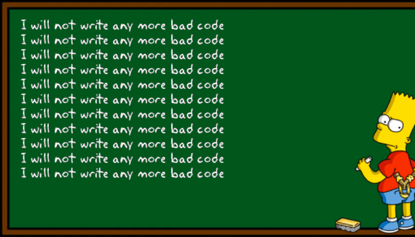

## Who is this article for?

This article is for developers who are looking to add PSR-2 code check to their project.

## Before You Begin

I am going to assume you know what PSR-2 coding style entails. If you are not fully aware of what PSR-2 is, please take time and read about it.

Below are some good reads -

*   [https://www.php-fig.org/psr/psr-2/](https://www.php-fig.org/psr/psr-2/)
*   [https://docs.opnsense.org/development/guidelines/psr2.html](https://docs.opnsense.org/development/guidelines/psr2.html)
*   [https://devticks.com/why-standards-are-so-important-in-development-b3ef973b02ad](https://devticks.com/why-standards-are-so-important-in-development-b3ef973b02ad)

> Any fool can write code that a computer can understand. Good programmers write code that humans can understand.  
> **Refactoring: Improving the Design of Existing Code, 1999. Martin Fowler.**

Now that you have a basic understanding of what PSR-2 is, let's jump into implementing it. We are going to implement it as a Unit test called `CodeStyleLinterTest`.

## Step 1 - Install Required Packages

### [PHP-CS-Fixer](https://github.com/FriendsOfPHP/PHP-CS-Fixer)

This tool will verify your coding standards as defined in the PSR-1, PSR-2, etc., or other community-driven ones like the Symfony one. You can also define your (team's) style through configuration. You can read all about the package here - [https://github.com/FriendsOfPHP/PHP-CS-Fixer](https://github.com/FriendsOfPHP/PHP-CS-Fixer). It even allows you to create custom rule-based on your requirements. Ok, so let's install it now to our PHP project

```bash
composer require friendsofphp/php-cs-fixer --dev
```

### [The Process Component](https://symfony.com/doc/current/components/process.html)

The Process component executes commands in sub-processes. You can also use `exec()` but for security reason, I would recommend using the process component package.

```bash
composer require symfony/process  --dev
```

As I am going to use these two packages only for my development purposes only, I have added them as dev dependencies of my `composer.json`.

## Step 2 - The Unit Test Case

### Script

```php
<?php

namespace Tests\Unit;

use Symfony\Component\Process\Process;
use function base_path;
use Tests\TestCase;

class CodeStyleLinterTest extends TestCase
{
    // Add more path to test
    const PATH_TO_TEST = [
        'app',
        'config',
        'public/index.php',
        'tests',
        'database'
    ];
    
    /** @test */
    public function psr2()
    {
        $phpCsFixerPath = base_path('vendor/bin/php-cs-fixer');
        // Let's check PSR-2 compliance for our code
        foreach (self::PATH_TO_TEST as $path) {
            $fullPath = base_path($path);
            // Run linter in dry-run mode so it changes nothing.
            $process = new Process([$phpCsFixerPath, 'fix', $fullPath, '--dry-run', '--allow-risky=no']);
            $process->run();
            // Exit code should be 0, else there is a problem with the PSR-2 compliance
            $this->assertEquals(
                0,
                $process->getExitCode(),
                $process->getOutput()
            );
        }
    }
}
```

I created this unit test for my laravel app, but you can use it for any PHP project. You can update the `PATH_TO_TEST` constant to include your directories or files you want to run the PSR-2 code check.

## Conclusion

Having a simple PSR-2 does not ensure code quality; it only makes the code look pretty i.e., formatting. You should conduct regular code review session to go over your code.



## Sources

*   [https://www.php-fig.org/psr/psr-2/](https://www.php-fig.org/psr/psr-2/)
*   [https://docs.opnsense.org/development/guidelines/psr2.html](https://docs.opnsense.org/development/guidelines/psr2.html)
*   [https://devticks.com/why-standards-are-so-important-in-development-b3ef973b02ad](https://devticks.com/why-standards-are-so-important-in-development-b3ef973b02ad)
*   [https://github.com/FriendsOfPHP/PHP-CS-Fixer](https://github.com/FriendsOfPHP/PHP-CS-Fixer)
*   [https://symfony.com/doc/current/components/process.html](https://symfony.com/doc/current/components/process.html)
*   [https://miro.medium.com/max/698/1\*zXeTjYDcMSz-0w-os6qFUg.png](https://miro.medium.com/max/698/1*zXeTjYDcMSz-0w-os6qFUg.png)

