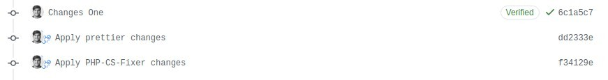

In this article, we will leverage Github Actions to fix our PHP, JS, and CSS code style.  

For most of my projects, I like to use [styleci.io](https://styleci.io/). Recently I was working on a project where I cannot use StyleCI because of compliance. Since our project was hosted on Github, we created Github workflows to replicate the functionality. Our project had two separate repositories, one for back-end API and one for our SPA frontend. So, we will be using two different Github workflows to style our codebase. But you can always combine it into one workflow depending on your requirement. 

I have created a [Demo Github repository](https://github.com/akki-io/demo-github-actions-code-style) that contains a working example of this concept. Let's discuss those two workflows. 

## Style PHP

This workflow fixes your PHP code to follow standards. We are using `PHP-CS-Fixer` for the same. 

We will need to do three things.
- Install the [PHP-CS-Fixer composer](https://github.com/akki-io/demo-github-actions-code-style/blob/master/composer.json) package.
- Configure our [Github workflow](https://github.com/akki-io/demo-github-actions-code-style/blob/master/.github/workflows/style-php-cs-fixer.yml).
- Configure our PHP-CS-Fixer [rules set](https://github.com/akki-io/demo-github-actions-code-style/blob/master/.php_cs)

### Step 1

Let's start by adding the `FriendsOfPHP/PHP-CS-Fixer` composer package to our codebase. 

`composer require friendsofphp/php-cs-fixer --dev`

### Step 2

Create a Github workflow inside the `.github/workflows` directory. I named my workflow as `style-php-cs-fixer.yml`.

```yaml
name: Style PHP-CS-Fixer

on:
  push:
    branches: [ master ]
  pull_request:
    branches: [ master ]

jobs:
  style:
    runs-on: ubuntu-latest
    steps:
      - uses: actions/checkout@v2
        with:
          ref: ${{ github.head_ref }}

      - name: Install composer packages
        run: composer install

      - name: Run PHP-CS-Fixer Style
        run: ./vendor/bin/php-cs-fixer fix

      - uses: stefanzweifel/git-auto-commit-action@v4
        with:
          commit_message: Apply PHP-CS-Fixer changes
```

### Step 3

Create a `.php_cs` file with the Rule Sets. You can view the list of available rules [here](https://github.com/FriendsOfPHP/PHP-CS-Fixer/blob/master/doc/rules/index.rst). 

I used the rule set that I use with most of my PHP/Laravel projects.

```php
<?php

use PhpCsFixer\Config;
use PhpCsFixer\Finder;

$rules = [
    'array_syntax' => ['syntax' => 'short'],
    'binary_operator_spaces' => [
        'default' => 'single_space',
        'operators' => ['=>' => null]
    ],
    'blank_line_after_namespace' => true,
    'blank_line_after_opening_tag' => true,
    'blank_line_before_statement' => [
        'statements' => ['return']
    ],
    'braces' => true,
    'cast_spaces' => true,
    'class_attributes_separation' => [
        'elements' => ['method']
    ],
    'class_definition' => true,
    'concat_space' => [
        'spacing' => 'none'
    ],
    'declare_equal_normalize' => true,
    'elseif' => true,
    'encoding' => true,
    'full_opening_tag' => true,
    'fully_qualified_strict_types' => true, // added by Shift
    'function_declaration' => true,
    'function_typehint_space' => true,
    'heredoc_to_nowdoc' => true,
    'include' => true,
    'increment_style' => ['style' => 'post'],
    'indentation_type' => true,
    'linebreak_after_opening_tag' => true,
    'line_ending' => true,
    'lowercase_cast' => true,
    'lowercase_constants' => true,
    'lowercase_keywords' => true,
    'lowercase_static_reference' => true, // added from Symfony
    'magic_method_casing' => true, // added from Symfony
    'magic_constant_casing' => true,
    'method_argument_space' => true,
    'native_function_casing' => true,
    'no_alias_functions' => true,
    'no_extra_blank_lines' => [
        'tokens' => [
            'extra',
            'throw',
            'use',
            'use_trait',
        ]
    ],
    'no_blank_lines_after_class_opening' => true,
    'no_blank_lines_after_phpdoc' => true,
    'no_closing_tag' => true,
    'no_empty_phpdoc' => true,
    'no_empty_statement' => true,
    'no_leading_import_slash' => true,
    'no_leading_namespace_whitespace' => true,
    'no_mixed_echo_print' => [
        'use' => 'echo'
    ],
    'no_multiline_whitespace_around_double_arrow' => true,
    'multiline_whitespace_before_semicolons' => [
        'strategy' => 'no_multi_line'
    ],
    'no_short_bool_cast' => true,
    'no_singleline_whitespace_before_semicolons' => true,
    'no_spaces_after_function_name' => true,
    'no_spaces_around_offset' => true,
    'no_spaces_inside_parenthesis' => true,
    'no_trailing_comma_in_list_call' => true,
    'no_trailing_comma_in_singleline_array' => true,
    'no_trailing_whitespace' => true,
    'no_trailing_whitespace_in_comment' => true,
    'no_unneeded_control_parentheses' => true,
    'no_unreachable_default_argument_value' => true,
    'no_useless_return' => true,
    'no_whitespace_before_comma_in_array' => true,
    'no_whitespace_in_blank_line' => true,
    'normalize_index_brace' => true,
    'not_operator_with_successor_space' => true,
    'object_operator_without_whitespace' => true,
    'ordered_imports' => ['sortAlgorithm' => 'alpha'],
    'phpdoc_indent' => true,
    'phpdoc_inline_tag' => true,
    'phpdoc_no_access' => true,
    'phpdoc_no_package' => true,
    'phpdoc_no_useless_inheritdoc' => true,
    'phpdoc_scalar' => true,
    'phpdoc_single_line_var_spacing' => true,
    'phpdoc_summary' => true,
    'phpdoc_to_comment' => true,
    'phpdoc_trim' => true,
    'phpdoc_types' => true,
    'phpdoc_var_without_name' => true,
    'psr4' => true,
    'self_accessor' => true,
    'short_scalar_cast' => true,
    'simplified_null_return' => false, // disabled by Shift
    'single_blank_line_at_eof' => true,
    'single_blank_line_before_namespace' => true,
    'single_class_element_per_statement' => true,
    'single_import_per_statement' => true,
    'single_line_after_imports' => true,
    'single_line_comment_style' => [
        'comment_types' => ['hash']
    ],
    'single_quote' => true,
    'space_after_semicolon' => true,
    'standardize_not_equals' => true,
    'switch_case_semicolon_to_colon' => true,
    'switch_case_space' => true,
    'ternary_operator_spaces' => true,
    'trailing_comma_in_multiline_array' => true,
    'trim_array_spaces' => true,
    'unary_operator_spaces' => true,
    'visibility_required' => [
        'elements' => ['method', 'property']
    ],
    'whitespace_after_comma_in_array' => true,
];

$project_path = getcwd();
$finder = Finder::create()
    ->in([
        $project_path
    ])
    ->name('*.php')
    ->notName('*.blade.php')
    ->ignoreDotFiles(true)
    ->ignoreVCS(true);

return Config::create()
    ->setFinder($finder)
    ->setRules($rules)
    ->setRiskyAllowed(true)
    ->setUsingCache(true);
```

You will need to modify the path on [line number 129](https://github.com/akki-io/demo-github-actions-code-style/blob/master/.php_cs#L129) to match your codebase. Here is an example rule sets that [laravel shit uses](https://gist.github.com/laravel-shift/cab527923ed2a109dda047b97d53c200).

Now our PHP Style is all set.

## Style JS

This workflow fixes your JS, CSS, and Vue code to follow standards. We are using `Prettier` for the same. 

We will need to do three things.
Install the [Prettier](https://github.com/akki-io/demo-github-actions-code-style/blob/master/package.json) package.
Configure our [Github workflow](https://github.com/akki-io/demo-github-actions-code-style/blob/master/.github/workflows/style-prettier.yml).
Configure our Prettier [configuration file](https://github.com/akki-io/demo-github-actions-code-style/blob/master/.prettierrc)

### Step 1

Let's start by adding the `Prettier` package to our codebase. 

`yarn add --dev --exact prettier`

### Step 2

Create a Github workflow inside the `.github/workflows` directory. I named my workflow as `style-prettier.yml`.

```yaml
name: Style Prettier

on:
  push:
    branches: [ master ]
  pull_request:
    branches: [ master ]

jobs:
  style:
    runs-on: ubuntu-latest
    steps:
      - uses: actions/checkout@v2
        with:
          ref: ${{ github.head_ref }}

      - name: Install node packages
        run: yarn

      - name: Run fixer
        run: yarn prettier --write *.{css,js,vue}

      - uses: stefanzweifel/git-auto-commit-action@v4
        with:
          commit_message: Apply prettier changes
```

### Step 3

Create a `.prettierrc` configuration file.

```json
{
    "printWidth": 100,
    "singleQuote": true,
    "tabWidth": 4,
    "trailingComma": "es5"
}
```

## Result

To verify that our workflows perform the desired actions. I have created a [pull request](https://github.com/akki-io/demo-github-actions-code-style/pull/1) will minor changes to the PHP, JS, CSS, and VUE files. 

As you can see, our workflow corrected our code style and added two new commits on our pull request. 



You can review what files were changed in each commit.
- [dd2333e](https://github.com/akki-io/demo-github-actions-code-style/pull/1/commits/dd2333e921a03226af081e1f1e52621766b5d8fe) - Applied Prettier changes.
- [f34129e](https://github.com/akki-io/demo-github-actions-code-style/pull/1/commits/f34129ed0cb52a6d487b69933ccee826b8a4e061) - Applied PHP-CS-Fixer changes.


### Links

* [PHP-CS-Fixer](https://github.com/FriendsOfPHP/PHP-CS-Fixer)
* [Prettier](https://prettier.io/)
* [Demo Github Repo](https://github.com/akki-io/demo-github-actions-code-style)
